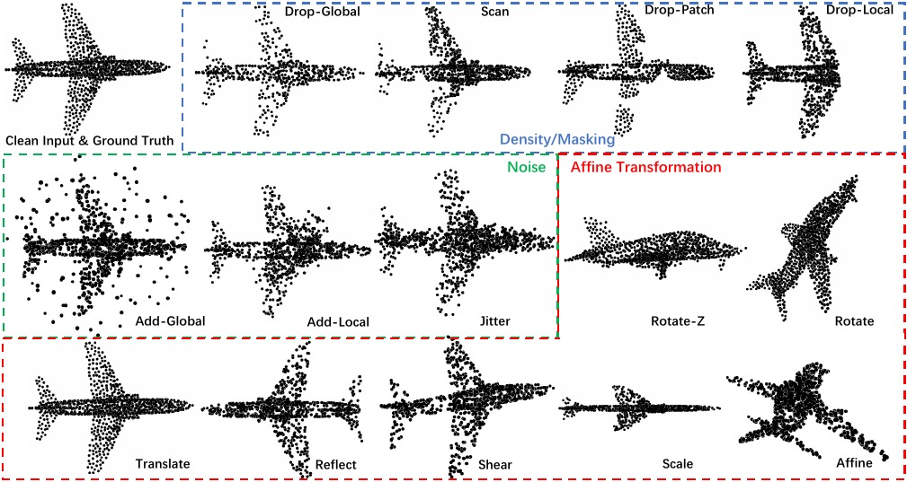
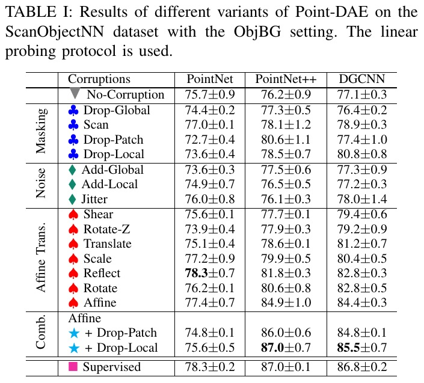

# [Point-DAE](https://arxiv.org/pdf/2211.06841)

# Update:
-> 2025/04: Paper accepted by [IEEE Transactions on Neural Networks and Learning Systems (TNNLS)](https://ieeexplore.ieee.org/document/10977775)

-> 2024/08: Checkpoints released.

-> 2023/09: update an init version, more downstream tasks to be added.

## [Point-DAE: Denoising Autoencoders for Self-supervised Point Cloud Learning](https://arxiv.org/pdf/2211.06841)
Masked autoencoder has demonstrated its effectiveness in self-supervised point cloud learning. Considering that masking is a kind of corruption, in this work we explore a more general denoising autoencoder for point cloud learning (Point-DAE) by investigating more types of corruptions beyond masking. Specifically, we degrade the point cloud with certain corruptions as input, and learn an encoder-decoder model to reconstruct the original point cloud from its corrupted version. 
Three corruption families (\ie, density/masking, noise, and affine transformation) and a total of fourteen corruption types are investigated with traditional non-Transformer encoders.
Besides the popular masking corruption, we identify another effective corruption family, \ie, affine transformation. The affine transformation disturbs all points globally, which is complementary to the masking corruption where some local regions are dropped. 
We also validate the effectiveness of affine transformation corruption with the Transformer backbones, where we decompose the reconstruction of the complete point cloud into the reconstructions of detailed local patches and rough global shape, alleviating the position leakage problem in the reconstruction.
Extensive experiments on tasks of object classification, few-shot learning, robustness testing, part segmentation, and 3D object detection validate the effectiveness of the proposed method.

|  |
|:-------------:|
| The studied corruptions. |

<p align="center">
  
</p>

## 1. Requirements
PyTorch >= 1.7.0;
python >= 3.7;
CUDA >= 9.0;
GCC >= 4.9;
torchvision;

```
pip install -r requirements.txt
```

```
# Chamfer Distance & emd
cd ./extensions/chamfer_dist
python setup.py install --user
cd ./extensions/emd
python setup.py install --user
# PointNet++
pip install "git+https://github.com/erikwijmans/Pointnet2_PyTorch.git#egg=pointnet2_ops&subdirectory=pointnet2_ops_lib"
# GPU kNN
pip install --upgrade https://github.com/unlimblue/KNN_CUDA/releases/download/0.2/KNN_CUDA-0.2-py3-none-any.whl
```

## 2. Datasets

We use ShapeNet, ScanObjectNN, ModelNet40 and ShapeNetPart in this work. See [DATASET.md](./DATASET.md) for details.

## 3. Pre-trained Models

|  Task | Dataset | Config | Download|      
|  ----- | ----- |-----|   -----|
|  Pre-training | ShapeNet |[pretrain_nontransformer](./cfgs/pretrain_PointCAE_affine_r3_dropout_local_4xlonger.yaml) | [Google Drive](https://drive.google.com/drive/folders/1Nl3g-_HqHJ3J-Cjdx99ZmM29JXnJJZqZ?usp=sharing) |
|  Pre-training | ShapeNet |[pretrain_transformer](./cfgs/pretrain_PointCAE_transformer_dropout_patch_affine_r3_maskpatch_p0005_whole.yaml) | [Google Drive](https://drive.google.com/drive/folders/1vAktAxgSNPNTNwLG89xcfrmRDWIYlhEH?usp=sharing) |

## 4. Running
We provide all the scripts for pre-training and fine-tuning in the [rerun.sh](./rerun.sh) and [rerun2.sh](./rerun2.sh). 
Additionally, we provide a simple tool to collect the mean and standard deviation of results, for example: ```python parse_test_res.py ./experiments/{experiments_settting}/cfgs/ --multi-exp```

### Point-DAE Pre-training
To pretrain Point-DAE on ShapeNet training set, run the following command. If you want to try different models or masking ratios etc., first create a new config file, and pass its path to --config.

```
CUDA_VISIBLE_DEVICES=<GPUs> python main.py --config cfgs/pretrain_PointCAE_{xx_adopted_corruption_xx}.yaml --exp_name <output_file_name>
```
### Point-DAE Fine-tuning

Fine-tuning on ScanObjectNN, run:
```
CUDA_VISIBLE_DEVICES=<GPU> python main.py --config cfgs/finetune_scan_hardest_{protocol}.yaml \
--finetune_model --exp_name <output_file_name> --ckpts <path/to/pre-trained/model>
```
Fine-tuning on ModelNet40, run:
```
CUDA_VISIBLE_DEVICES=<GPU> python main.py --config cfgs/finetune_modelnet_{protocol}.yaml \
--finetune_model --exp_name <output_file_name> --ckpts <path/to/pre-trained/model>
```
Few-shot learning on ModelNet40 or ScanObjectNN, run:
```
CUDA_VISIBLE_DEVICES=<GPU> python main.py --config cfgs/fewshot_{dataset}_{protocol}.yaml --finetune_model \
--ckpts <path/to/pre-trained/model> --exp_name <output_file_name> --way <5 or 10> --shot <10 or 20> --fold <0-9>
```
Part segmentation on ShapeNetPart, run:
```
cd segmentation
CUDA_VISIBLE_DEVICES=<GPU> python main.py --ckpts <path/to/pre-trained/model> --root path/to/data --learning_rate 0.0002 --epoch 300
```
More Downstream tasks [to add]

## Reference

```
@article{zhang2022point,
  title={Point-dae: Denoising autoencoders for self-supervised point cloud learning},
  author={Zhang, Yabin and Lin, Jiehong and Li, Ruihuang and Jia, Kui and Zhang, Lei},
  journal={arXiv preprint arXiv:2211.06841},
  year={2022}
}
```
